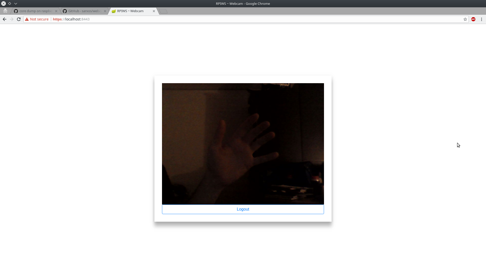
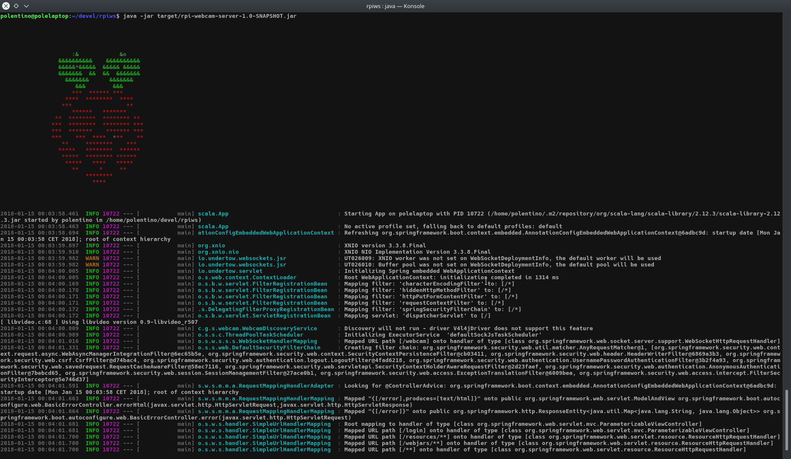
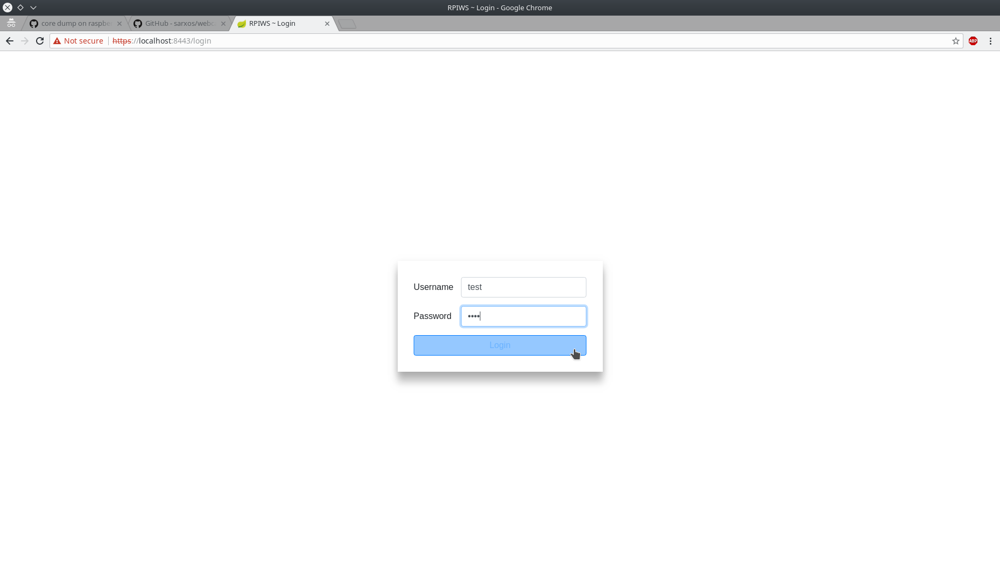

# Introduction

RPIWS (aka Raspberry PI Webcam Server) is a simple project to stream the output of the webcam **where RPIWS
runs**, be it a Raspberry PI, your laptop or any other device, in a secure way.

Sadly, some [issues](https://github.com/sarxos/webcam-capture/issues/588) with ARM devices made difficult to test
it on a RPI, so at the moment it's tested and working on Intel latops.

## Motivations

Have fun with a RPI, Spring Boot and Scala ;)

## Software Stack

The application is written in [Scala](https://www.scala-lang.org) on top of [Spring Boot](https://projects.spring.io/spring-boot/)
to build the web application, plus the [webcam-capture](https://github.com/sarxos/webcam-capture/) project made by @sarxos to get the data from the
webcam.

There's also a bit of [jQuery](https://jquery.com) and [Bootstrap](https://getbootstrap.com) for the user interface.

## Meaning of Secure

In the introduction I said the application to be secure; by secure, I mean "secure as a web application should be":

* all traffic must use SSL;
* if a client tries to connect through  HTTP, it has to be redirected to HTTPS;
* access to the webcam stream must be allowed to authenticated users only;

of course I could have gone deeper, and implement for example bruteforce detection, but let's say that HTTPS and a strong password
are good enough for your privacy. Patches are welcome, by the way!

# Build instruction

1. clone the repo ``$ git clone https://github.com/polentino/rpiws`` and then ``cd rwpiws``
2. create the keystore for your application server (note: validity 3650 means 10 years) and follow the instructions in the console ``$ keytool -genkey -alias rpiws -storetype PKCS12 -keyalg RSA -keysize 2048 -keystore keystore.p12 -validity 3650``
3. edit the file ``application.properties``, locate the property ``server.ssl.key-store-password`` and substitute the current value the password you used in step **2.**
4. locate also the properties ``auth.user.name`` and ``auth.user.password``: change them to the values you prefer. These will be the credentials that need to be used in the login page of the application
5. compile and package the project (requires Maven to be installed): ``mvn compile package``

# Run RPIWS

1. type ``$ java -jar target/rpi-webcam-server-1.0-SNAPSHOT.jar``

2. open a browser in your laptop, and type ``http://localhost:8080``:
    * since the certificate you build is self-signed, any browser will promptly war you that the website is not secure. The reason
    is because it cannot determine your identity, but the certificate itself **is** secure because **you** made it ;)
    So don't worry, click on ``ADVANCED`` -> ``proceed to localhost(unsafe)`` if you're using Chrome, or
    ``ADVANCED`` -> ``Add Exception..`` -> ``Confirm Security Exception`` if you're using Firefox
3. you will be presented now with the login page:  enter your credentials to see the stream! 

# Connect from other devices

If RPIWS is running on DeviceA, and you want look at its stream from DeviceB, which is in the same home network
of DeviceA, all you have to do is note the local IP address of DeviceA, and use this value instead of ``localhost``.

**Example:** if DeviceA has an IP address of 192.168.10.222, then in DeviceB all you need to do is open a browser
and type ``http://192.168.10.222:8080`` (or ``https://192.168.10.222:8443``).

If, on the other hand, you want to make DeviceA accessible to the entire internet, you need at least to open the correct
ports in your router, then note down your public-facing IP address (by using a service like
[whatismyipaddress.com](https://whatismyipaddress.com)) and use that IP or, even better, setup a dynamic DNS at
[noIP](https://www.noip.com) (this is just one of the many providers, pick the one you prefer the most).

# License

The source is distributed under the [WTFPL license](http://www.wtfpl.net); if you find some of the lines here useful, just include my name.